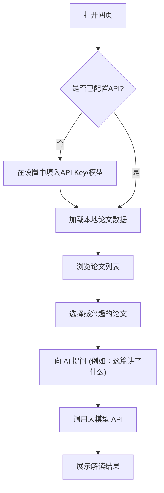

## 1. 产品概述
构建一个名为「arXiv 论文解读助手」的 Web 应用，用于展示每日抓取的 arXiv 天体物理学（astro-ph）最新论文，并集成大语言模型（LLM）API 进行智能解读。
- 解决问题：帮助科研人员快速筛选和理解每天大量更新的论文，支持基于具体文章或汇总内容的 AI 对话。
- 目标价值：提供一个高颜值、易用的可视化界面，取代命令行和纯文本阅读，提升学术研究效率。

## 2. 核心功能

### 2.1 用户角色
| 角色 | 注册方式 | 核心权限 |
|------|----------|----------|
| 本地科研用户 | 无需注册 | 浏览本地论文、配置 LLM API、进行 AI 对话与解读 |

### 2.2 功能模块
1. **主页**: 左侧论文列表与数据统计面板，右侧 AI 智能对话面板。
2. **设置模块**: 配置 LLM API 密钥、Base URL 和模型名称。

### 2.3 页面详细说明
| 页面名称 | 模块名称 | 功能描述 |
|----------|----------|----------|
| 主页 | 论文概览 | 展示今日文章总数、子领域分类统计数据 |
| 主页 | 论文列表 | 支持快速浏览，点击某篇文章可将其设为 AI 解读的当前上下文 |
| 主页 | AI 助手面板 | 选中文章后，在对话框内向指定大模型提问，获取文章总结或细节解读 |
| 主页 | 深度阅读支持 | 将文章的 arXiv 号和完整链接自动注入 AI 上下文，支持 LLM 根据 arXiv 号获取对应文章网址，进行细致阅读 |
| 全局 | API 配置弹窗 | 允许用户输入自定义的 OpenAI 兼容接口地址和 API Key |

## 3. 核心流程
使用自然语言描述的主要用户流程：用户打开网页后，首先在设置中填入自己偏好的大模型 API 密钥。接着可以浏览今天自动抓取的论文列表。当对某篇论文（例如关于 FRB 的文章）感兴趣时，点击该论文，右侧的 AI 助手会将其作为上下文，用户可以提问：“帮我总结一下这篇论文的核心发现”，大模型随即返回解读结果。

## 4. UI 设计
### 4.1 设计风格
- 整体风格：**科研极客风 (Minimalist & Academic)**，强调专业感与科技感。
- 主题色：**深色模式 (Dark Mode)**，背景色使用深空灰 (`#0f172a`)，强调色使用电光蓝 (`#3b82f6`) 或荧光绿。
- 字体：标题使用 `Space Grotesk`，正文使用系统无衬线字体，代码/数据展示使用等宽字体。
- 布局：桌面端**左右分栏 (Split View)** 布局。左侧为数据与列表，右侧为 AI 对话框。
- 视觉细节：组件使用细边框、微弱发光效果 (Glow effects) 以及半透明毛玻璃材质 (Glassmorphism)。

### 4.2 页面设计概览
| 页面名称 | 模块名称 | UI 元素 |
|----------|----------|---------|
| 主页 | 顶部导航栏 | 极简 Logo，日期展示，设置按钮 |
| 主页 | 论文列表(左侧) | 卡片式设计，包含标题、作者、分类 Tag，hover 产生浮起与发光效果 |
| 主页 | 对话面板(右侧) | 聊天气泡布局，底部有输入框和发送按钮，带有打字机动画 |
| 弹窗 | API 设置弹窗 | 居中毛玻璃弹窗，密码掩码输入框，发光保存按钮 |

### 4.3 响应式
- 桌面端优先 (Desktop-first)，适合宽屏展示左右分栏。
- 移动端下自动切换为上下布局或抽屉式隐藏左侧列表，确保触控体验流畅。