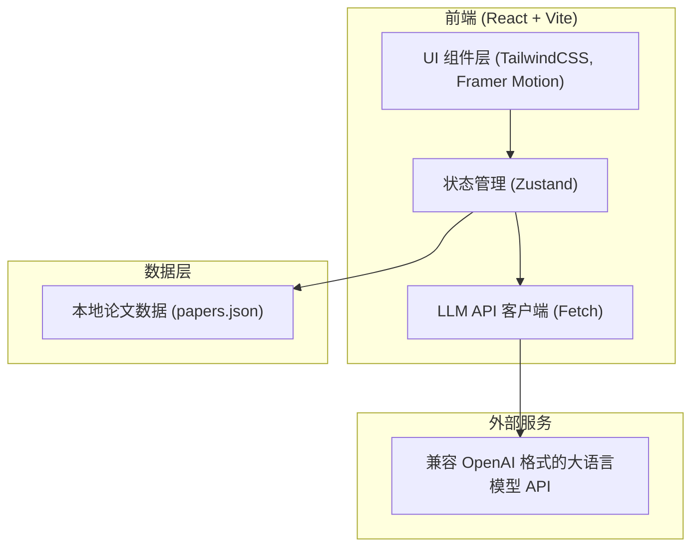

## 1. 架构设计


## 2. 技术说明
- 前端框架：`React@18` + `tailwindcss@3` + `vite`
- 状态管理：`zustand` (用于管理用户选择的论文和聊天记录)
- 图标与动画：`lucide-react` (提供界面图标), `framer-motion` (实现卡片发光、对话气泡等微动效)
- Markdown 渲染：`react-markdown` (渲染 AI 的回复)
- 数据源：我们将修改 Python 抓取脚本，让其除了生成 markdown 之外，也生成一个 `papers.json` 静态文件。前端直接 `import` 或 `fetch` 这个 JSON 数据。
- API 通信：使用标准 `fetch` 调用用户配置的 OpenAI 兼容接口，无需后端中转。

## 3. 路由定义
本应用为一个单页面应用 (SPA)，无需复杂的路由配置。
| 路由 | 用途 |
|------|------|
| / | 主应用界面，包含左侧论文列表与右侧 AI 聊天面板 |

## 4. API 定义
不需要专门的后端服务，纯前端直连 LLM API。
调用的接口格式 (兼容 OpenAI):
```typescript
interface ChatRequest {
  model: string;
  messages: Array<{ role: 'system' | 'user' | 'assistant', content: string }>;
  temperature?: number;
}
```

## 5. 数据模型
本地数据 `papers.json` 结构定义如下：
```typescript
interface Paper {
  title: string;
  authors: string[];
  summary: string;
  categories: string[];
  url: string;
}

interface DailyData {
  date: string;
  total: number;
  subjects_counter: Record<string, number>;
  papers: Paper[];
}
```